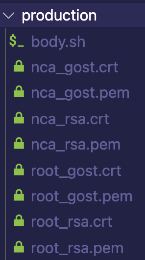

# CERTS

В данной директории должны находиться [CA](https://searchsecurity.techtarget.com/definition/certificate-authority) \
сертификаты от pki.nce для полноценной работы kalkancrypt.

В дальнейшем, они будут добавлены в доверенные сертификаты.

Для этого используется утилита [update-ca-certificates](https://www.unix.com/man-page/linux/8/update-ca-certificates/).

## Пример директории

